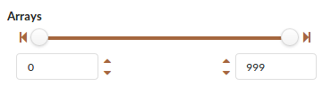

# semantic-ui-range-selector
Add-on range selector for Semantic UI. This is based on tyleryasaka's awesome range slider: https://github.com/tyleryasaka/semantic-ui-range

The most important difference between Range Selector and tyleryasaka's Range Slider is that you can select
both "start" and "end" by sliding thumbs.

More demo: [Demo](https://codepen.io/tyuan73/pen/PKbqyo)

## Usage

### Step 1

Add Semantic UI (https://github.com/Semantic-Org/Semantic-UI).

Add the rangeselector.js and rangerangeselector.css files from this repo to your project.

### Step 2

Add the range selector html.

	

### Step 3

Instantiate the range slider with jQuery:

	$(document).ready(function() {
		$('#my-range').range({
			min: 0,
			max: 10,
			start: 2,
			end: 9
		});
	});

## Configuration Options

Notice the settings object you pass into the jQuery function in step 3. There are 6 settings you can pass in:
* min (number; required) - the lowest value (inclusive) of the range
* max (number; required) - the highest value (inclusive) of the range
* start (number; optional) - the initial start value of the range (must be between min and end; defaults to min)
* end (number; optional) - the initial end value of the range (must be between start and max; defaults to max)
* step (number; optional) - the increment amount between values (defaults to 1)
* onChange (function; optional) - function to call each time the value of the range changes; parameters:
	* value (number) - the updated value of the slider
	* meta (object) - a hash with properties:
		* `triggeredByUser` (boolean). `true` unless the change was triggered programmatically using `set value`. Useful for preventing infinite loops if you are calling a method that will call `set value`.

## *Getting* the slider value programmatically

Use the `onChange` callback in the configuration options. For example:

    var myRangeValue; // your javascript variable that will store the value of the slider

    $('#range').range({
      min: 0,
      max: 100,
      start: 5,
	  end: 10,
      onChange: function(val) { myRangeValue = val; } // assigning the callback argument to your variable each time the value changes
    });

## *Setting* the slider value programmatically

You may also set the slider value with jQuery using the 'setValue' query like so:

    $('#range').range('set value', 17); // Sets slider with id 'range' to value 17

Note that this will only work on a slider that has already been instantiated.

## Preventing infinite get/set loops

If you're running code in your `onChange` callback that calls the `set value` method, you will encounter an infinite loop. You can prevent this by checking the `triggeredByUser` property.

	$('#range').range({
		min: 0,
		max: 100,
		start: 5,
		end: 10,
		onChange: function(value, meta) {
			if(meta.triggeredByUser) {
				// now you can run code that will call `set value`
			}
		}
	});

## Demo

Check out the [demo](https://codepen.io/tyuan73/pen/PKbqyo) for examples.
